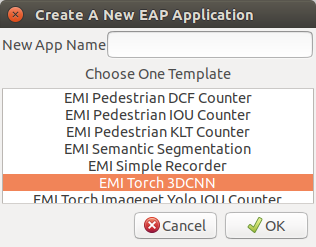
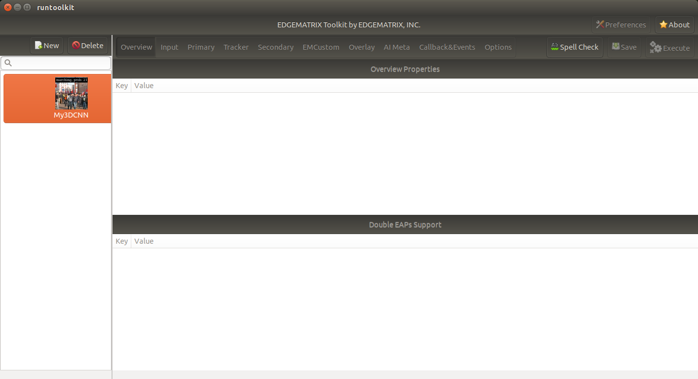
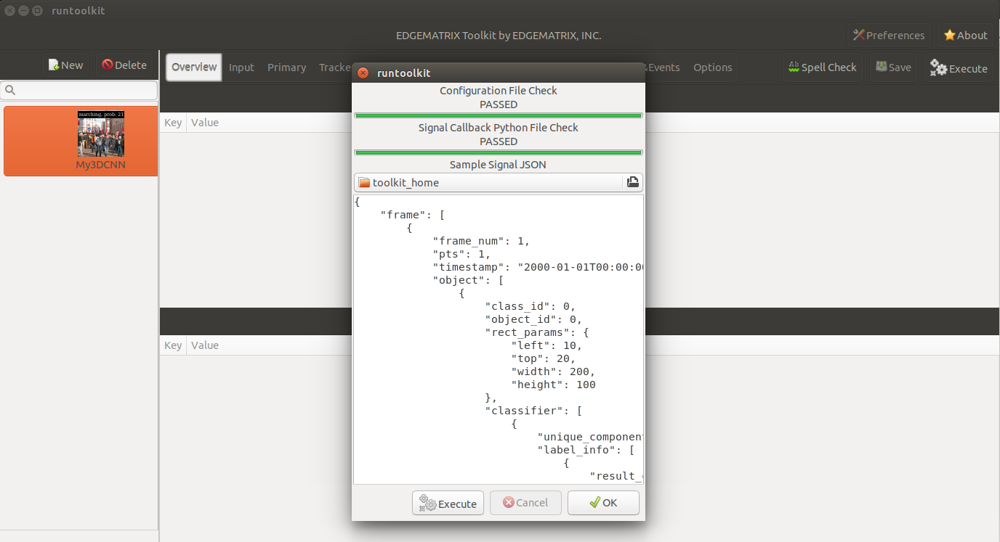
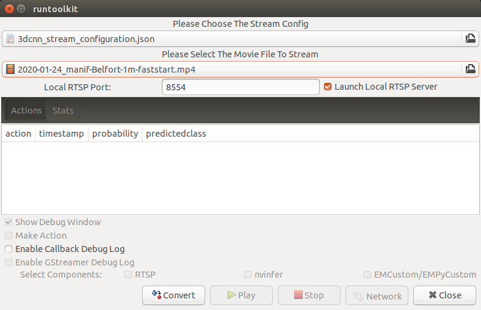
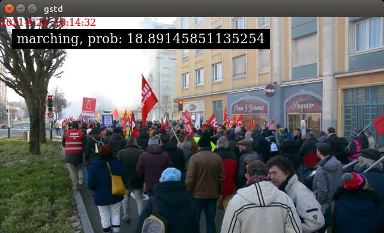
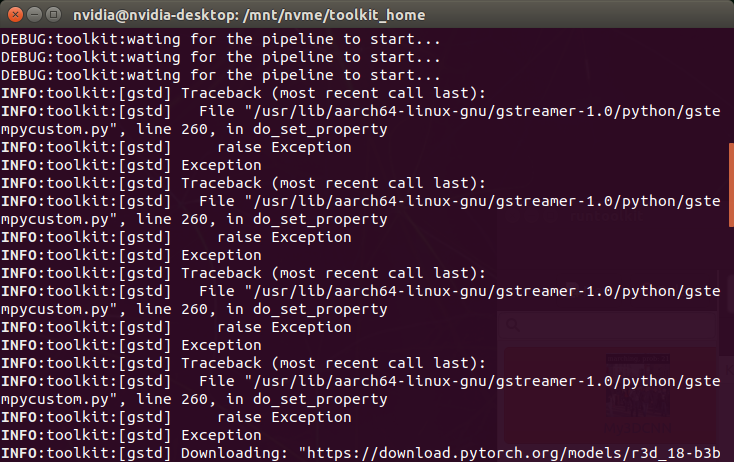
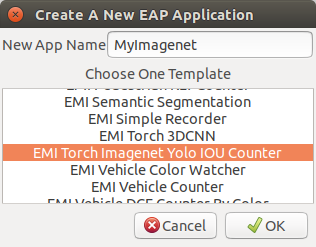
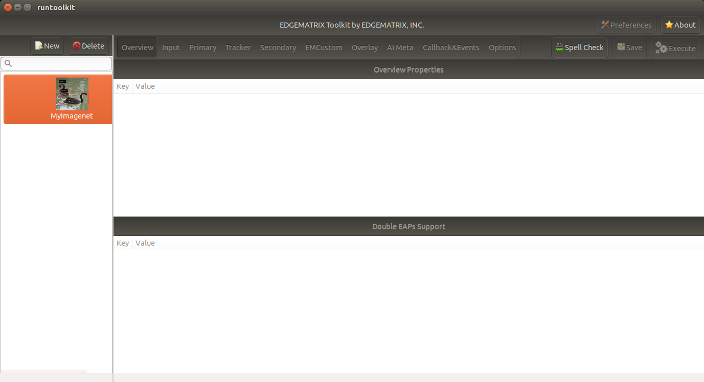
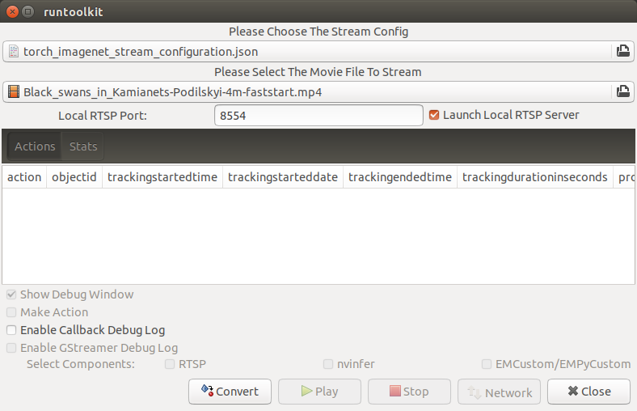
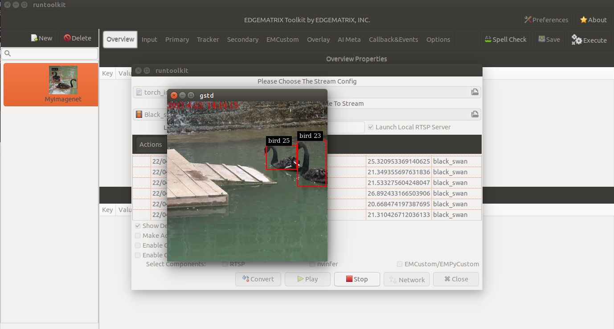

Sample Torch Apps
=========================================

#. Just Torch

    #. Why just Torch?
    #. Development/Runtime Environment

#. Torch reference apps

    #. EMI Torch 3DCNN
    #. EMI Torch Imagenet Yolo IOU Counter

#. EMI Torch 3DCNN

    #. Pipeline Configuration
    #. Torch Model
    #. App Configuration
    #. Stream Configuration
    #. Notes

#. EMI Torch Imagenet Yolo IOU Counter

    #. Pipeline Configuration
    #. Torch Model
    #. App Configuration
    #. Stream Configuration
    #. Notes

--------------------------------------------------------
Just Torch
--------------------------------------------------------

In this section, two reference apps, in which a PyTorch algorithm as a Python program just runs respectively, will be shown in details. 

^^^^^^^^^^^^^^^^^^^^^^^^^^^^^^^^^^^^^^^^^^^^^^^^^^^^^^^^
Why just Torch?
^^^^^^^^^^^^^^^^^^^^^^^^^^^^^^^^^^^^^^^^^^^^^^^^^^^^^^^^

The first version of the EDGEMATRIX Stream was fully built on top of the DeepStrem (a collection of NVIDIA's GStreamer elements), which means a GStreamer element for an inference is `nvinfer` that is an engine to run a TensorRT model. And the structure of a pipeline is well standardized and consists of a primary inference followed by a tracker, and a secondary inference. It is well designed for a tracking by detection approach with additional secondary classifications. And running such deep learning models on an edge device in realtime became easier than ever.

On the other hand, an AI algorithm is getting more complex as PyTorch is getting more popular. And as an edge device supports such algorithms, more powerful edge device has been emerging along with lower power consumption devices. Tesla T4 and Xavier NX are such devices.

This would be partly because more camera models with powerful SoCs such as Ambarella has entered into the market. So, running a detection and/or classifications is considered as a camera job, not necessarily a special job by an edge device. So, to differentiate, an edge device is asked to run more complex models than before.

That's why we decided to design our own GStreamer element that just runs a PyTorch algorithm as a Python program, and which is automagically integrated with the EDGEMATRIX Service.

It is the element called `EMPyCustom`. With this element, we have a plan to extend our EDGEMATRIX Stream to support IoT sensor data processing as well as ONVIF Profile T and S camera integration (e.g. running a detection in camera that passes inference results to an EDGEMATRIX Stream through an RTSP stream).

^^^^^^^^^^^^^^^^^^^^^^^^^^^^^^^^^^^^^^^^^^^^^^^^^^^^^^^^
Development/Runtime Environment
^^^^^^^^^^^^^^^^^^^^^^^^^^^^^^^^^^^^^^^^^^^^^^^^^^^^^^^^

The development environment on the L4T 32.4.3 is the same as the runtime one.

- Python: 3.6.9
- torch: 1.7.0
- torchvision: 0.8.1
- opencv: 4.1.1
- numpy: 1.13.3
- PIL: 5.1.0

Please note that the main memory is shared by CPU and GPU on Jetson. So, almost all of the models won't run on an AI Box Light.

Two apps demonstrated here are meant to be run on an AI Box Xavier NX or an AI Box Advance.

--------------------------------------------------------
Torch reference apps
--------------------------------------------------------

We are going to demonstrate two apps running pre-trained models from `torch.models <https://pytorch.org/vision/0.8/models.html>`_. One is from Video Classification, and anotehr is from Classification. The Video classification app is to show how to run a non-per-frame algorithm that is impossible in the structure of the DeepStream. The Classification app is to show how to integrate an EMPyCustom with the existing structure, in which a classification with PyTorch plays a role of a secondary inference.

Each model is downloaded to a directory under models by configuring the hub dir. This is done in a start() method.

--------------------------------------------------------
EMI Torch 3DCNN
--------------------------------------------------------

As a preparation, run the `prepare_resource.sh` command in the template folder as below.

.. code-block:: bash

    /mnt/nvme/toolkit_home$ cd templates/EMI\ Torch\ 3DCNN/resource/
    /mnt/nvme/toolkit_home/templates/EMI Torch 3DCNN/resource$ ./prepare_resource.sh

It will run a GStreamer pipeline that involves a Python program in an EMPyCustom, which triggers to download a pre-trained model. Then, you will see a window that shows people are marching, but which won't show any classification results.

Then, launch your toolkit, and create a new application from a template called `EMI Torch 3DCNN` as below.

^^^^^^^^^^^^^^^^^^^^^^^^^^^^^^^^^^^^^^^^^^^^^^^^^^^^^^^^
Pipeline Configuration
^^^^^^^^^^^^^^^^^^^^^^^^^^^^^^^^^^^^^^^^^^^^^^^^^^^^^^^^

When you look into the `emi_stream_config.json` file, you can see that this pipeline consists of only 4 elements as follows.

- input
- empycustom
- overlay
- aimeta

In a pipeline of the EDGEMATRIX Stream v1, it is impossible to construct a pipeline without an nvinfer. This is one of custom pipelines. So, you see no pipeline configurations on GUI.

Also note that the input resolution is 640x360.

^^^^^^^^^^^^^^^^^^^^^^^^^^^^^^^^^^^^^^^^^^^^^^^^^^^^^^^^
Torch Model
^^^^^^^^^^^^^^^^^^^^^^^^^^^^^^^^^^^^^^^^^^^^^^^^^^^^^^^^

This app uses `ResNet 3D <https://pytorch.org/vision/0.8/models.html#resnet-3d>`_ from Video Classification models. An input for these models is expected to be:

- mini-batches of 3-channel RGB videos of shape
  - 3 x T x H x W, where H and W are expected to be 112, and T is a number of video frames in a clip
- a range of [0, 1] 
- normalized using mean = [0.43216, 0.394666, 0.37645] and std = [0.22803, 0.22145, 0.216989]

This is managed by the `video_classification.py` program that is placed under the `resource` directory. 

^^^^^^^^^^^^^^^^^^^^^^^^^^^^^^^^^^^^^^^^^^^^^^^^^^^^^^^^
Torch Program
^^^^^^^^^^^^^^^^^^^^^^^^^^^^^^^^^^^^^^^^^^^^^^^^^^^^^^^^

Each image passed from an input element is processed in the `process_ip` method. As a blue print, you can start with the following template.

.. code-block:: python

    # Convert the buffer to a numpy array
    print('mapping a buffer')
    ret, map_info = io_buffer.map(Gst.MapFlags.READ)
    try:
        print('frame_meta = {}'.format(in_meta["frame"][0]))
        w = 640
        h = 360
        print('creating an array of (w,h) = ({}, {})'.format(w, h))
        buffer_array = np.ndarray(
            shape=(h, w, NUM_PLANES),
            dtype=np.uint8,
            buffer=map_info.data)

        rect = buffer_array[:, :, 0:3]
        out_meta_array = []
        
        if rect.size:
            image = Image.fromarray(rect, mode="RGB")
            cuda_image = data_transform(image).unsqueeze(0).cuda()

            # TODO: Do something on cuda_image, then store the inference result from this frame in the out_meta_array

    except:
        print('failed to run process due to the error, {}'.format(sys.exc_info()[1]))
    finally:
        print('unmapping a buffer')
        io_buffer.unmap(map_info)
    return str(out_meta_array)

There are a couple of points you need to note:

1. w, h should be the same resolution as defined for the input element
2. the format of an input image data is RGBS as defined for the empycustom element

Then, in the TODO section, it does a little bit complex job as below.

.. code-block:: python

            # add to a list
            cuda_list.append(cuda_image)
            # make an inference when a list is full
            if len(cuda_list) == CLIP_LENGTH:
                try:
                    out_obj = {}
                    with torch.no_grad():
                        # create a batch
                        # mini-batches of 3-channel RGB videos of shape (3 x T x H x W), where H and W are expected to be 112, and T is a number of video frames in a clip. 
                        batch = torch.cat(cuda_list).permute(1,0,2,3).unsqueeze(0)
                        print("running an infernce on an array of {} at {}".format(batch.shape, batch.device))
                        out = model(batch)
                        print("inference result of {}".format(out.shape))
                        values, indices = out.topk(1, 1, True, True)
                        if len(labels) >= indices.item():
                            print("topk = {}({} at {})".format(labels[indices.item()], values, indices))
                            out_obj["predicted_class"] = labels[indices.item()]
                        else:
                            print("not enough labels are provided, predicted_class is returned as its index")
                            out_obj["predicted_class"] = str(indices.item())
                        out_obj["probability"] = values.item()
                    out_meta_array.append(out_obj)
                except:
                    print('failed to run an inference due to the error, {}'.format(sys.exc_info()[1]))
                finally:
                    # remove the first
                    del cuda_list[0]
                    print("removed the first item, cuda_list size = {}".format(len(cuda_list)))

        print("cuda memory allocated, list size = {}, {}".format(torch.cuda.memory_allocated(), len(cuda_list)))

^^^^^^^^^^^^^^^^^^^^^^^^^^^^^^^^^^^^^^^^^^^^^^^^^^^^^^^^
Stream Configuration
^^^^^^^^^^^^^^^^^^^^^^^^^^^^^^^^^^^^^^^^^^^^^^^^^^^^^^^^

The `torch_3dcnn_stream` under the streams folder is used for the execution. It is a simple one that defines the only one record action as below.

.. code-block:: javascript

  "action_rules": [
    {
      "rule_name": "3DCNN Classification",
      "and": [
        {
          "key": "probability",
          "operator": ">=",
          "value": 20
        }
      ],
      "or": [],
      "action": {
        "action_name": "record",
        "duration_in_seconds": 5,
        "max_duration_in_seconds": 60
      }
    }
  ]

^^^^^^^^^^^^^^^^^^^^^^^^^^^^^^^^^^^^^^^^^^^^^^^^^^^^^^^^
Execution
^^^^^^^^^^^^^^^^^^^^^^^^^^^^^^^^^^^^^^^^^^^^^^^^^^^^^^^^

You can run this app in the same way as the other apps.

The callback program assumes only the `frame` property at the root level, and the `timestamp` property in a frame. So, you can use the default signal to validate your callback program.

But it is recommend to use a dedicated sample signal that has the `emcustom` property in a frame, and the `probability` and `predicted_class` in an empycsutom.

Then, choose the stream config above, and the movie called `2020-01-24_manif-Belfort-1m-faststart.mp4` downloaded from wikimedia.

Now, press the `convert` button, and you are ready to run the app. It will show a video classification result with its probability as below.

You might have noticed that there was an error during launching an app and actually during running the `prepare_resource.sh` script. It is an odd, but harmless exception caused by a bug of this version of pyds. Without raising this exception, the pyds won't allow to update any property of a GStreamer element in Python.

--------------------------------------------------------
EMI Torch Imagenet Yolo IOU Counter
--------------------------------------------------------

As a preparation, run the `prepare_resource.sh` command in the template folder as below.

.. code-block:: bash

    /mnt/nvme/toolkit_home$ cd templates/EMI\ Torch\ Imagenet\ Yolo\ IOU\ Counter/resource/
    /mnt/nvme/toolkit_home/templates/EMI Torch Imagenet Yolo IOU Counter/resource$ ./prepare_resource.sh

It will run a GStreamer pipeline that involves a Python program in an EMPyCustom, which triggers to download a pre-trained model. Then, you will see a window that shows two black swans are swimming, but which won't show any classification results.

Then, launch your toolkit by increasing the timeout by adding `-t 60`, and create a new application from a template called `EMI Torch Imagenet Yolo IOU Counter` as below.

^^^^^^^^^^^^^^^^^^^^^^^^^^^^^^^^^^^^^^^^^^^^^^^^^^^^^^^^
Pipeline Configuration
^^^^^^^^^^^^^^^^^^^^^^^^^^^^^^^^^^^^^^^^^^^^^^^^^^^^^^^^

When you look into the `emi_stream_config.json` file, you can see that this pipeline consists of 6 elements as follows.

- input
- primary
- tracker
- empycustom
- overlay
- aimeta

If an empycustom is replaced with a secondary element, it becomes a familier primary/tracker/secondary pipeline.

This is also one of custom pipelines. So, you see no pipeline configurations on GUI, here, too.

Also note that the input resolution is 360x360.

^^^^^^^^^^^^^^^^^^^^^^^^^^^^^^^^^^^^^^^^^^^^^^^^^^^^^^^^
Torch Model
^^^^^^^^^^^^^^^^^^^^^^^^^^^^^^^^^^^^^^^^^^^^^^^^^^^^^^^^

This app uses `SqueezeNet <https://pytorch.org/vision/0.8/models.html#id15>`_ from Classification models. An input for these models is expected to be:

- mini-batches of 3-channel RGB images of shape
  - 3 x H x W, where H and W are expected to be at least 224
- a range of [0, 1] 
- normalized using mean = [0.485, 0.456, 0.406] and std = [0.229, 0.224, 0.225]

^^^^^^^^^^^^^^^^^^^^^^^^^^^^^^^^^^^^^^^^^^^^^^^^^^^^^^^^
Torch Program
^^^^^^^^^^^^^^^^^^^^^^^^^^^^^^^^^^^^^^^^^^^^^^^^^^^^^^^^

A program as a secondary likely consists of the following structure.

.. code-block:: python

    # Convert the buffer to a numpy array
    print('mapping a buffer')
    ret, map_info = io_buffer.map(Gst.MapFlags.READ)
    try:
        print('frame_meta = {}'.format(in_meta["frame"][0]))
        w = 360
        h = 360
        print('creating an array of (w,h) = ({}, {})'.format(w, h))
        buffer_array = np.ndarray(
            shape=(h, w, NUM_PLANES),
            dtype=np.uint8,
            buffer=map_info.data)

        # Get object array
        object_array = in_meta["frame"][0]["object"]
        cuda_list = []
        with torch.no_grad():
            for obj in object_array:

                # TODO: Create an image for each object

            if len(cuda_list) > 0:

                # TODO: Do something with cuda_list, then store the inference results from this frame in the out_meta_array

    except:
        print('failed to run process due to the error, {}'.format(sys.exc_info()[1]))
    finally:
        print('unmapping a buffer')
        io_buffer.unmap(map_info)
    return str(out_meta_array)

At the first TODO section, it cropps an object at a square shape where possible.

.. code-block:: python

                # Cut the object
                left = int(obj["rect_params"]["left"])
                top = int(obj["rect_params"]["top"])
                width = int(obj["rect_params"]["width"])
                height = int(obj["rect_params"]["height"])
                if width <= height:
                    diff = int((height - width) / 2)
                    left_with_diff = max(0, left-diff)
                    right_with_diff = min(w, left+width+diff)
                    print('taller rect, the new (left, right) = ({}, {}) out of {}'.format(left_with_diff, right_with_diff, obj["rect_params"]))
                    # Skip the transparency (A) plane since the model is RGB
                    rect = buffer_array[top:top + height, left_with_diff:right_with_diff, 0:3]
                else:
                    diff = int((width - height) / 2)
                    top_with_diff = max(0, top-diff)
                    bottom_with_diff = min(h, top+height+diff)
                    print('wider rect, the new (top, bottom) = ({}, {}) out of {}'.format(top_with_diff, bottom_with_diff, obj["rect_params"]))
                    # Skip the transparency (A) plane since the model is RGB
                    rect = buffer_array[top_with_diff:bottom_with_diff, left:left + width, 0:3]
                image = Image.fromarray(rect, mode="RGB")
                cuda_image = data_transform(image).unsqueeze(0).cuda()
                cuda_list.append(cuda_image)

At the second TODO section, it does a batch of inferences and add those results to the out meta object.

.. code-block:: python

                batch = torch.cat(cuda_list)
                out = model(batch)
                print("inference result of {}".format(out.shape))
                for obj in out:
                    out_obj = {}
                    if len(labels) > obj.argmax():
                        out_obj["predicted_class"] = labels[obj.argmax()]
                    else:
                        out_obj["predicted_class"] = str(obj.argmax())
                    out_obj["probability"] = obj[obj.argmax()].item()
                    print('out_obj: {}'.format(out_obj))
                    out_meta_array.append(out_obj)

^^^^^^^^^^^^^^^^^^^^^^^^^^^^^^^^^^^^^^^^^^^^^^^^^^^^^^^^
Stream Configuration
^^^^^^^^^^^^^^^^^^^^^^^^^^^^^^^^^^^^^^^^^^^^^^^^^^^^^^^^

The `torch_imagenet_stream` under the streams folder is used for the execution. It is also a simple one that defines only two actions as below. Without the second upload action, you can't see if events are coming out or not on the GUI.

.. code-block:: javascript

  "action_rules": [
    {
      "rule_name": "Recording",
      "and": [
        {
          "key": "probability",
          "operator": ">",
          "value": 20
        }
      ],
      "or": [],
      "action": {
        "action_name": "record",
        "duration_in_seconds": 5,
        "max_duration_in_seconds": 60
      }
    },
    {
      "rule_name": "Upload to AWS Kinesis Firehose",
      "and": [
        {
          "key": "tracking_ended_time",
          "operator": "!=",
          "value": "N/A"
        },
        {
          "key": "tracking_duration_in_seconds",
          "operator": ">=",
          "value": 1.3
        }
      ],
      "or": [],
      "action": {
        "action_name": "upload",
        "deliveryStreamName": "trafficStream",
        "accessKey": "",
        "secretKey": "",
        "region": ""
      }
    }
  ]

^^^^^^^^^^^^^^^^^^^^^^^^^^^^^^^^^^^^^^^^^^^^^^^^^^^^^^^^
Execution
^^^^^^^^^^^^^^^^^^^^^^^^^^^^^^^^^^^^^^^^^^^^^^^^^^^^^^^^

You can run this app in the same way as the other apps.

The callback program assumes only the `frame` property at the root level, and the `timestamp` property in a frame. So, you can use the default signal to validate your callback program although it is recommend to use a dedicated sample signal..

Then, choose the stream config above, and the movie called `Black_swan_in_kamianets-Podilskyi-4m-faststart.mp4` downloaded from wikimedia.

Now, press the `convert` button, and you are ready to run the app. It will show classification results as below.

